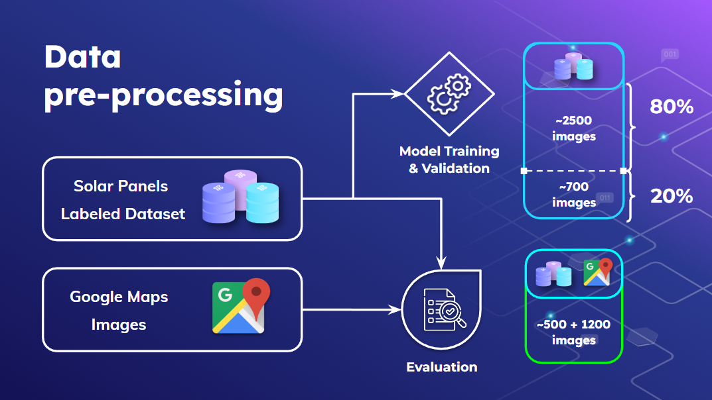
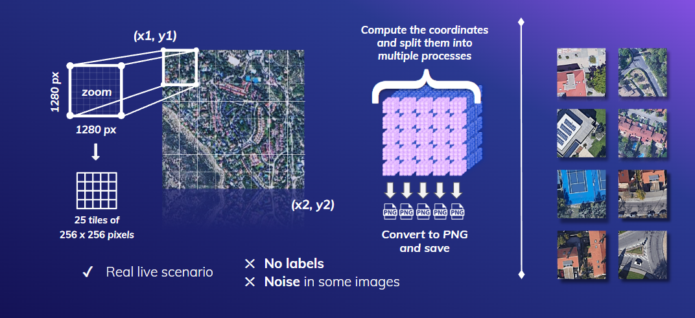
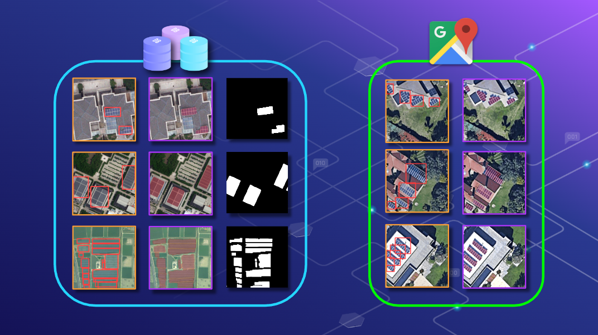

# Deep-Learning-for-Solar-Panel-Recognition

Riconoscimento delle celle fotovoltaiche in immagini aeree con **Convolutional Neural Networks** (CNNs).

**Rilevamento degli oggetti** con i modelli YOLOv5 e **segmentazione delle immagini** con Unet++.

## 💽 Installazione + pytorch CUDA 11.3
Crea un ambiente virtuale **Python 3.8** e esegui il seguente comando:
```
pip install -r requirements.txt && pip install torch torchvision --extra-index-url https://download.pytorch.org/whl/cu113
```
Con **Anaconda**:
```
pip install -r requirements.txt && conda install pytorch torchvision torchaudio cudatoolkit=11.3 -c pytorch
```

## 💻 Come iniziare?

------------
### RILEVAMENTO DEGLI OGGETTI
1. Specifica la posizione dei dati in [sp_dataset.yaml](src/models/yolo/sp_dataset.yaml).
2. Preprocessa e genera le annotazioni con [yolo_preprocess_data.py](src/features/yolo_preprocess_data.py) e [create_yolo_annotations.py](src/features/create_yolo_annotations.py) rispettivamente.
3. Esegui [yolo_train.py](src/models/yolo_train.py) per l'addestramento.
4. Esegui [yolo_detect.py](src/models/yolo_detect.py) per l'inferenza.

### SEGMENTAZIONE
1. Specifica la struttura dei dati in [segmentation/datasets.py](src/models/segmentation/datasets.py).

## 🔍 Fonti dei dati

-----------
* ### ☀ Dataset dei pannelli solari
    _Dataset multi-risoluzione per la segmentazione dei pannelli fotovoltaici da immagini satellitari e aeree_ (https://zenodo.org/record/5171712)
  

## 🛠 Pipeline di elaborazione

------------




## 🧪 Modelli

-----------
* ### Rilevamento degli oggetti
  * **YOLOv5-S:** 7.2 M parametri
  * **YOLOv5-M:** 21.2 M parametri
  * **YOLOv5-L:** 46.5 M parametri
  * **YOLOv5-X:** 86.7 M parametri

  Le architetture si basano sul repository [YOLOv5](https://github.com/ultralytics/yolov5).
  
  Scarica tutti i modelli [qui](https://drive.google.com/drive/folders/1gBkeFI5_Y2Ny8kI7xv3XEfl9KlPYCGQf?usp=sharing).

* ### Segmentazione delle immagini
  * **Unet++:** ~50 M parametri

  Le architetture si basano sul repository [segmentation_models.pytorch](https://github.com/qubvel/segmentation_models.pytorch).
  
  Scarica tutti i modelli [qui](https://drive.google.com/drive/folders/1gBkeFI5_Y2Ny8kI7xv3XEfl9KlPYCGQf?usp=sharing).

## 📈 Risultati

---------------



🌐 Organizzazione del progetto
------------

    ├── LICENSE
    ├── README.md          <- Il README principale per gli sviluppatori che utilizzano questo progetto.
    ├── app
    │       ├── data       <- Dataset di addestramento (ZENODO): lo devi scaricare dal link Google Drive.
    │
    ├── models             <- Modelli addestrati e serializzati: li devi scaricare dal link Google Drive.
    │
    │
    │
    ├── requirements.txt   <- Il file dei requisiti per riprodurre l'ambiente di analisi, es. generato con `pip freeze > requirements.txt`
    │
    ├── src                    <- Codice sorgente per l'uso in questo progetto.
    │       ├── __init__.py    <- Rende src un modulo Python
    │       │
    │       │
    │       ├── features                             <- Script per trasformare i dati grezzi in caratteristiche per la modellazione
    │       │       ├── create_yolo_annotations.py   <- Script sperimentale per creare annotazioni YOLO.
    │       │       └── yolo_preprocess_data.py      <- Script per preprocessare le annotazioni YOLO.
    │       │
    │       ├── models                               <- Script per addestrare modelli e poi usare i modelli addestrati per fare previsioni
    │               ├── segmentation                 <- Script di segmentazione per addestrare il modello Unet++.
    │               └── yolo                         <- Script di rilevamento oggetti per addestrare modelli YOLOv5.
    │      
    │       
    │
    └── 
--------